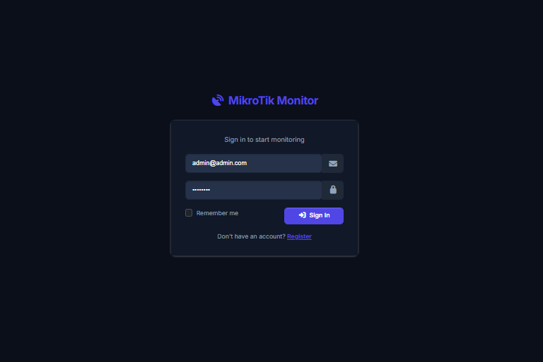
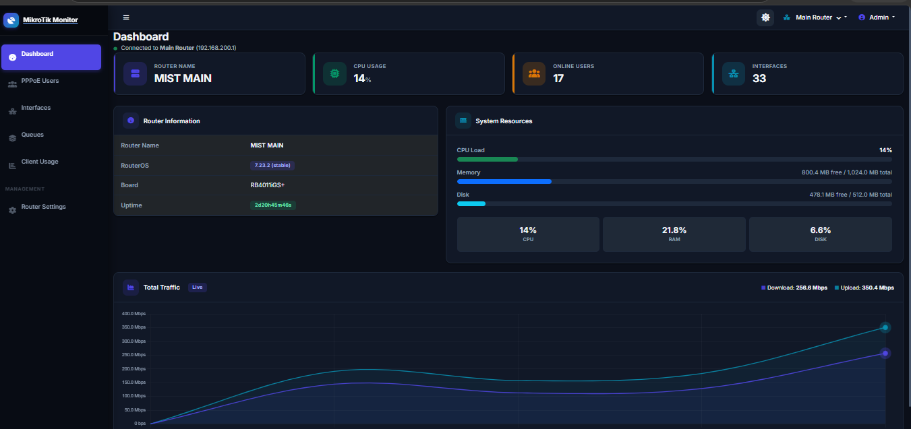
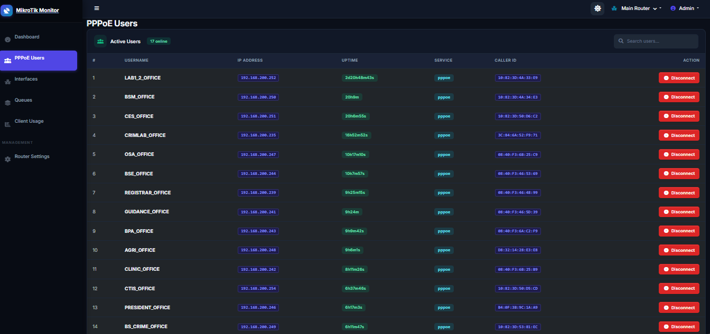
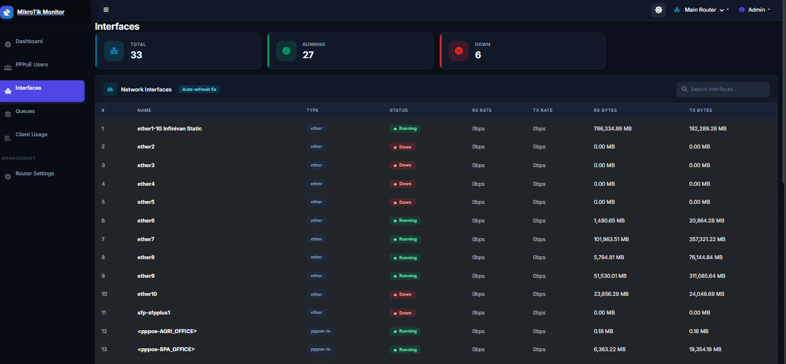
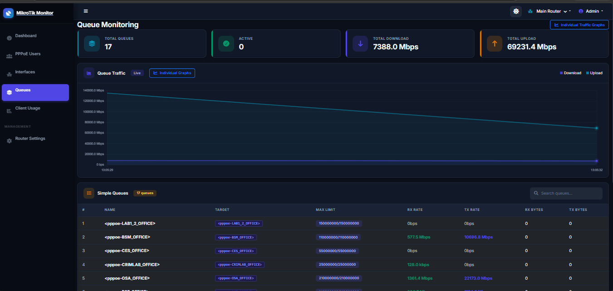
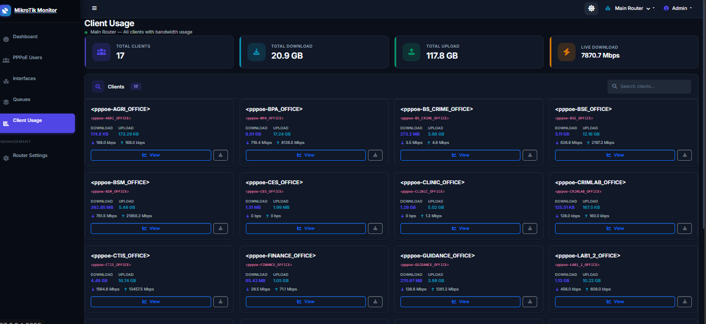

# MikroTik PPPoE Client Monitoring

A full-featured MikroTik router monitoring web application with multi-router support, live traffic graphs, PPPoE client management, and per-client usage tracking.

## Screenshots

### Login


### Dashboard


### PPPoE Users


### Interfaces


### Queue Monitoring


### Client Usage


### Client Usage Detail


## Features

- **Multi-Router Support** — Monitor multiple MikroTik routers from a single dashboard
- **Live Traffic Graphs** — Real-time bandwidth charts with pulsing beat animation (3s refresh)
- **PPPoE User Management** — View active PPPoE sessions and disconnect users instantly
- **Queue Monitoring** — Per-queue bandwidth graphs with individual traffic views
- **Client Usage Tracking** — Daily/weekly/monthly usage per client with CSV export
- **Dark Mode** — Full dark theme with localStorage persistence
- **Responsive UI** — AdminLTE 4 + Bootstrap 5 sidebar layout
- **Auto-Refresh** — Interfaces page refreshes every 5 seconds

## Tech Stack

| Component | Technology |
|-----------|-----------|
| Backend | Laravel 12, PHP 8.2 |
| Frontend | AdminLTE 4, Bootstrap 5, jQuery |
| Charts | Chart.js |
| Router API | RouterOS API (evilfreelancer/routeros-api-php) |
| Build | Vite 7 |

## Requirements

- PHP 8.2+
- MySQL/MariaDB
- XAMPP or similar stack
- Node.js & npm
- MikroTik RouterOS with API enabled (port 8728)

## Installation

1. **Clone the repo**
   ```bash
   git clone https://github.com/johnsuagan/mikrotik-pppoe-client-monitoring.git
   cd mikrotik-pppoe-client-monitoring
   ```

2. **Install PHP dependencies**
   ```bash
   composer install
   ```

3. **Install JS dependencies & build**
   ```bash
   npm install
   npm run build
   ```

4. **Configure environment**
   ```bash
   copy .env.example .env
   php artisan key:generate
   ```
   Edit `.env` and set your database credentials and default MikroTik connection:
   ```
   MIKROTIK_HOST=192.168.200.1
   MIKROTIK_PORT=8728
   MIKROTIK_USER=laravel
   MIKROTIK_PASS=your_password
   ```

5. **Run migrations**
   ```bash
   php artisan migrate
   ```

6. **Add a router** via the web UI at `/routers/create` or use the `.env` defaults.

7. **Start the usage logger** (logs queue usage every 5 minutes)
   ```bash
   php artisan schedule:work
   ```

8. **Serve the app**
   ```bash
   php artisan serve
   ```
   Visit http://127.0.0.1:8000

## Pages

| Route | Description |
|-------|-------------|
| `/` | Dashboard — router info, system resources, live total traffic graph |
| `/pppoe` | Active PPPoE users with disconnect |
| `/interfaces` | Network interfaces with live rates (auto-refresh 5s) |
| `/queues` | Simple queues overview with aggregate traffic graph |
| `/queues/traffic` | Individual bandwidth graph per queue |
| `/usage` | All clients with live download/upload rates |
| `/usage/{router}/{client}` | Per-client daily/weekly/monthly usage charts + CSV export |
| `/routers` | Add, edit, test, and delete routers |

## MikroTik Setup

1. Enable the API service on your MikroTik router:
   ```
   /ip service set api disabled=no port=8728
   ```
2. Create a monitoring user:
   ```
   /user add name=laravel password=your_password group=read
   ```
3. Ensure the server can reach the router on port 8728.

## License

MIT
